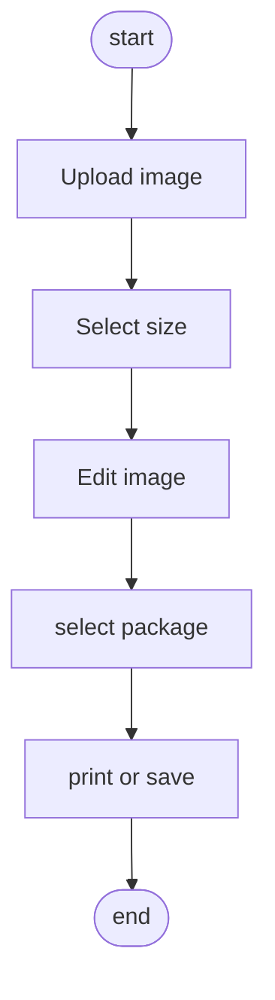

# App Flow

```mermaid
flowchart TB

step0([start]) --> step1[Upload image]
step1 --> step2[Select size]
step2 --> step3[Edit image]
step3 --> step4[select package]
step4 --> step5[print or save]
step5 --> stop([end])
```
